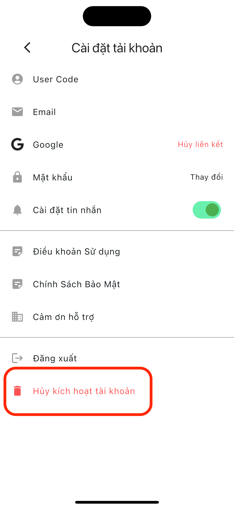

Cập nhật lần cuối: Ngày 1 tháng 10 năm 2024

### Cách xóa tài khoản của bạn

- Nếu bạn muốn xóa tài khoản của mình, vui lòng hủy kích hoạt tài khoản thông qua cài đặt tài khoản người dùng.
- Khi bạn nhấn "Hủy kích hoạt tài khoản", tài khoản của bạn sẽ bị xóa.

